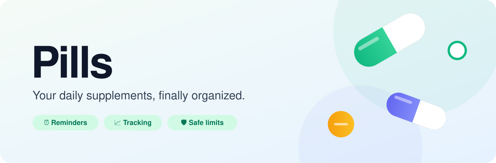

<div align="center">

<picture>
  <source media="(prefers-color-scheme: dark)" srcset="./assets/banner-dark.svg">
  
</picture>

<br/>

**Pills is the app that makes taking your supplements effortless.**<br/>
Plan your stack, get reminded at the right moment, and always know you're within the safe limits.

<br/>


</div>

---

## 💊 Why Pills?

Vitamin D in the morning, magnesium before bed, omega-3 with lunch, and was that zinc today or yesterday?
Most people who take supplements juggle several products, different times of day and different rules (with food, on an empty stomach, not together with coffee …). It's easy to forget, double up, or quietly give up.

And it's surprisingly easy to take **too much**: the same vitamin D, zinc or vitamin B6 often hides in your multivitamin, your immune booster *and* your single capsule. More isn't always better, and some nutrients can cause harm above a certain daily amount.

**Pills turns that mess into a simple daily routine.**

<table>
  <tr>
    <td width="25%" valign="top">
      <h3>🗂️ Organize</h3>
      Add your supplements once: dosage, timing and notes. Pills builds your personal daily plan automatically.
    </td>
    <td width="25%" valign="top">
      <h3>⏰ Remember</h3>
      Smart reminders at exactly the right time, grouped so you're not pinged five times a morning.
    </td>
    <td width="25%" valign="top">
      <h3>🛡️ Stay safe</h3>
      See your daily amount of each nutrient next to the official EU and US upper limits.
    </td>
    <td width="25%" valign="top">
      <h3>📈 Stay consistent</h3>
      Check off each intake with one tap, build streaks, and see your history at a glance.
    </td>
  </tr>
</table>

## 🛡️ Never overdose by accident

This is what makes Pills different. For every nutrient in your stack, Pills shows how much you take per day **side by side with the recommended maximum daily intake** from both sides of the Atlantic:

| | Reference | Source |
|:-:|---|---|
| 🇪🇺 | **Tolerable Upper Intake Level (UL)** | European Food Safety Authority (EFSA) |
| 🇺🇸 | **Tolerable Upper Intake Level (UL)** | U.S. National Academies, published by the NIH Office of Dietary Supplements |

If your plan gets close to or goes over a limit, you'll see it right away, *before* you take the next capsule, not after.

> [!NOTE]
> The limits shown in Pills are general reference values for healthy adults. They don't replace individual advice from a doctor or pharmacist, especially during pregnancy, with medical conditions or when taking medication.

## ✨ What we're building

| | Feature | What it means for you |
|:-:|---|---|
| 📋 | **Your personal stack** | Every supplement, dose and schedule in one clean overview. |
| 🛡️ | **EU & US upper limits** | Your daily intake per nutrient compared with EFSA and U.S. maximums. |
| 🔔 | **Intelligent reminders** | Morning, noon, evening, or tied to your meals and routines. |
| ✅ | **One-tap check-off** | Log an intake in a second, without digging through menus. |
| 📊 | **Progress & streaks** | Visual history that keeps you motivated to stick with it. |
| 📦 | **Refill awareness** | Know when a bottle is running low *before* it's empty. |
| 🔒 | **Privacy by design** | Your health data belongs to you. We collect only what's needed. |

## 🧭 Our principles

> **Simple over clever.** Taking a supplement should take seconds, so tracking it should too.
>
> **Privacy is non-negotiable.** Health data is personal. We build with GDPR and data minimization at the core.
>
> **Supportive, not medical.** Pills helps you stay organized. It doesn't replace advice from a doctor or pharmacist.

## 🛣️ How it works

```text
  1. Add your supplements  →  2. Check against EU/US limits  →  3. Get reminded  →  4. Tap to log  →  5. Watch your streak grow
```

## 📱 Where to find Pills

<table>
  <tr>
    <td width="50%" valign="top">
      <h3>📱 The iOS app</h3>
      Built natively in Swift for iPhone: fast, clean and at home on your device.
    </td>
    <td width="50%" valign="top">
      <h3>🌐 The website</h3>
      Everything about Pills, our features and how we handle your data.
    </td>
  </tr>
</table>

## 🤝 Get in touch

We're a small team from Germany building Pills with a lot of care.
Have feedback, an idea, or want to work with us? Reach out to us through our website, we'd love to hear from you.

<div align="center">

<br/>

<sub>Made with 💚 in Germany · © Pills</sub>

</div>
